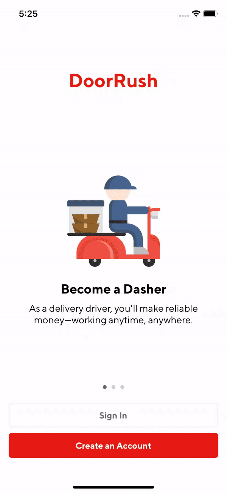

 # DoorRush

[](https://github.com/Edwin97/DoorRush/blob/master/LICENSE)
[](https://swift.org)
[](https://twitter.com/edwinchan97)

DoorRush iOS App is developed by [Edwin Chan](https://twitter.com/EdwinChan97) and written in Swift 5.

<h3>
<kbd></kbd>
</h3>

# Installation
## CocoaPods
To install the dependencies, simply run the following line:

```ruby
pod install
```


## Compatibility

This project is written in Swift 5.0 and requires Xcode 11.5 or newer to build and run.

DoorRush iOS app is compatible with iOS 13.5+.

## Author

* [Edwin Chan](https://twitter.com/EdwinChan97)

## License

Copyright 2020 Edwin Chan.

Licensed under MIT License: https://opensource.org/licenses/MIT
